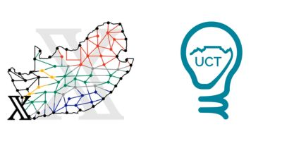
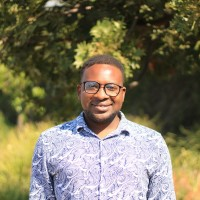

> The First South African Workshop on AI Safety and Governance is a multi-disciplinary workshop organised by Effective Altruism UCT and will be hosted at IndabaX. 

# Program

> Talk Title: A Guided Walk Through the African AI Safety Landscape
>
> Speaker: Jonas Kgomo (Equiano Research Lab)

> Talk Title: Perspectives on AI Governance in Africa
>
> Speaker: Zainab Chirwa (Effective Altruism UCT Chair and LLB Student at UCT)

> Talk Title: An Introduction to Technical AI Safety Research
>
> Speaker: Benjamin Sturgeon (Independent AI Safety Researcher and OpenPhilanthropy Grantee)

# Speakers

[Jonas Kgomo](https://www.linkedin.com/in/jonas-kgomo/)

[Zainab Chirwa](https://www.linkedin.com/in/zainab-chirwa-16734855/)

[Benjamin Sturgeon](https://www.linkedin.com/in/benjamin-sturgeon-41221241/)

# Organiser

[Claude Formanek](https://www.linkedin.com/in/claude-formanek/)